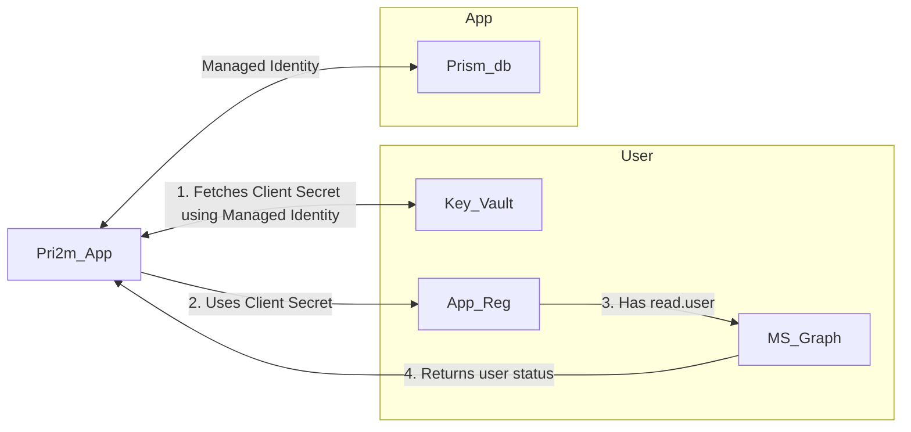

- TOC
{:toc}

# Authentication using Entra ID



## Azure SQL Database  

Azure SQL Database: [Connect to MSSQL database in Django using Tokens](https://dev.to/kummerer94/connect-to-mssql-database-in-django-using-tokens-3oid)

Django can authenticate against the Azure SQL Database using tokens. 

In the dev environment Django authenticates against the database using whatever credential has been used in VSCode when running `az login`; _much_ more preferable than storing passwords!  

In production we should set up a User Managed Identity for the App resource to authenticate against the Database. This _should_ still work with `DefaultAzureCredential()` but we may need to look at chaining credentials.   

This authentication is at the app level and not the user logging in to the site.  

## User login and permissions  

Django Entra Auth: [django-entra-auth](https://pypi.org/project/django-entra-auth/)

`django-entra-auth` can be used to authenticate users against Entra ID and provides a `request.user.is_authenticated` status. It also pulls a bunch of user details from Entra ID and populates the Django user fields (eg `user`, `email` etc.).  

It requires an App Registration in Azure, with `User.Read` permissions on Microsoft Graph. In production we will need to use a key vault to store the `client_secret` of this App Registration.  

When logged in a user is created in Django Admin. Permissions for the site can be managed via Django Admin.  
[Using the Django authentication system](https://docs.djangoproject.com/en/6.0/topics/auth/default/)  

Decorators on views can be used to ensure they can only be accessed by authenticated users with the correct permissions.  

```python
@login_required
@permission_required(["<app_label_>.<permission>_<model>"], raise_exception=True)
def my_view():
    ...
```

There are four default permissions automatically created for every Model on migration:
- add: 'foo.add_bar'
- change: 'foo.change_bar'
- delete: 'foo.delete_bar'
- view: 'foo.view_bar'

We may need to make use of custom permissions moving forward but for now we'll make do with these.  

From Django Admin I have created a group and assigned permissions to the group. Adding users to the group assigns them those permissions. These permissions are checked by the above decorators and access denied if absent. The first argument in the `permission_required` decorator can be a list of permissions. All must be met for access to be granted.  

Combining `login_required` with `permission_required` and `raise_exception=True` returns a 403 Forbidden error if the current authenticated user does not have appropriate permissions. If the user is not signed in they will be redirected to sign in.  

- I have created a Group in Django Admin called 'DAT'.  
- Permissions for `view`, `add` and `change` to appropriate models have been granted to this group.  
    - `delete` permissions are not used, as Pri2m only deals in logical deletions (which are actually updates).  
- Basically I went through each View and determined what operations it performs on which Models and added those permissions requirements to the `permission_required` list, and then granted those permissions to the DAT group.  
- For testing I have one login outside of that Group and another that has membership.  

IMPORTANT:
Must include this in `settings.py` as without it a user will lose membership of all Django Permissions Groups when they login. `django-entra-auth` will try to map their existing permissions and group membership from Entra ID to Django Admin, but because that's not included in the scope of the `CLAIM_MAPPING` it will return empty and map that instead, clearing all Django Group memberships.  
[https://tnware.github.io/django-entra-auth/settings_ref.html#groups-claim](https://tnware.github.io/django-entra-auth/settings_ref.html#groups-claim)  

```python
ENTRA_AUTH = {
    "GROUPS_CLAIM": None,
}
```
